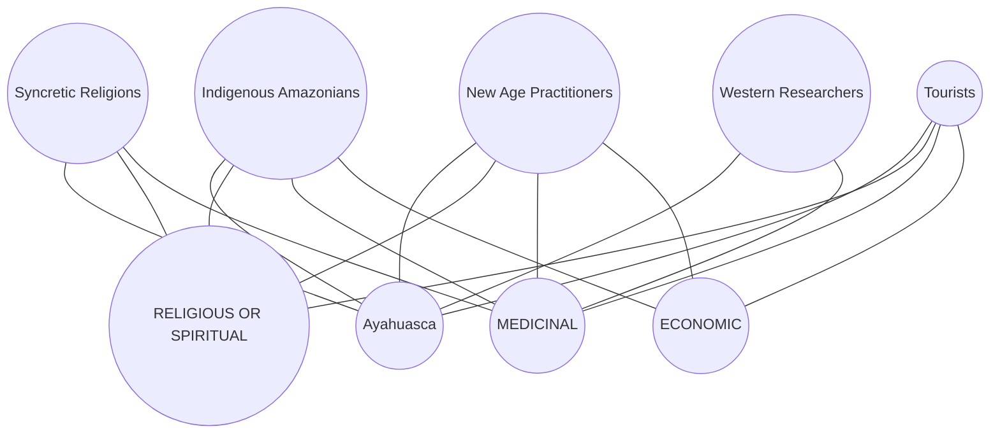

`mdp-breadcrumbs`

# VisJS examples

## Table data
`:width=50%`

|id|label|
|--|-----|
|1|Node 1|
|2|Node 2|
|3|Node 3|
|4|Node 4|
|5|Node 5|

|id|label|
|--|-----|
|1|Node 1|
|2|Node 2|
|3|Node 3|
|4|Node 4|`#t1`

|id|label|
|--|-----|
|1|Node 1|
|2|Node 2|
|3|Node 3|
|4|Node 4|  `#t2`

|id|label|
|--|-----|
|1|Node 1|
|2|Node 2|
|3|Node 3|
|4|Node 4|
`#t3`

|id|label|
|--|-----|
|1|Node 1|
|2|Node 2|
|3|Node 3|
|4|Node 4|  
`#t4`

|id|label|
|--|-----|
|1|Node 1|
|2|Node 2|
|3|Node 3|
|4|Node 4|

`#t4`

|id|label|`#t5`
|--|-----|
|1|Node 1|
|2|Node 2|
|3|Node 3|
|4|Node 4|

|id|label|
|--|-----|
|1|Node 1|
|2|Node 2|
|3|Node 3|
|4|Node 4|
`#g1-nodes`

|from|to|
|----|--|
|1|3|
|1|2|
|2|4|
|2|5|
|3|3|
`#g1-edges`

`mdp-visjs edges=g1-edges nodes=g1-nodes caption="VisJS Graph from local Markdown table data"`

## Data from URL
`:width=50%`

`mdp-visjs url=https://raw.githubusercontent.com/plant-humanities/essays/main/ayahuasca/Networks.tsv caption="VisJS Graph from remote TSV file"`

# Mermaid example
`:width=50%`

`caption="Mermaid Graph"`
