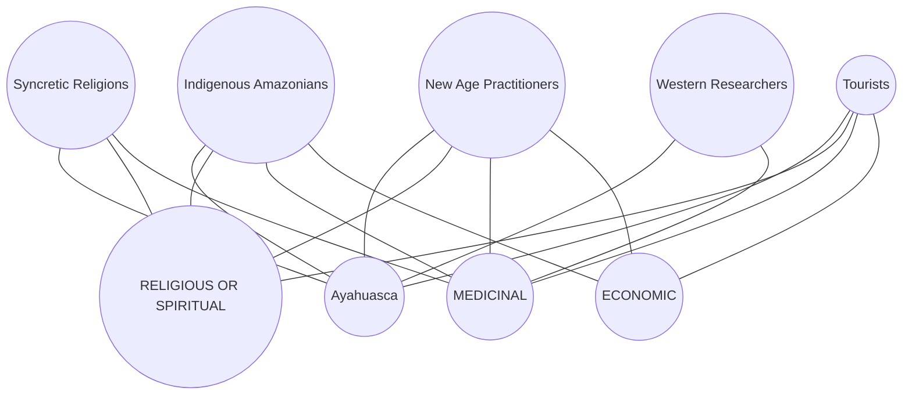

```mermaid
graph TD
    A((Indigenous Amazonians)) --- B((Ayahuasca))
    F((New Age Practitioners)) --- B
    G((Syncretic Religions)) --- B
    H((Tourists)) --- B
    I((Western Researchers)) --- B
    A --- C((RELIGIOUS OR SPIRITUAL))
    A --- D((MEDICINAL))
    A --- E((ECONOMIC))
    F --- C
    F --- D
    F --- E
    G --- C
    G --- D
    H --- C
    H --- D
    H --- E
    I --- D
```
`caption="A caption string" :width=500px :height=500px`
